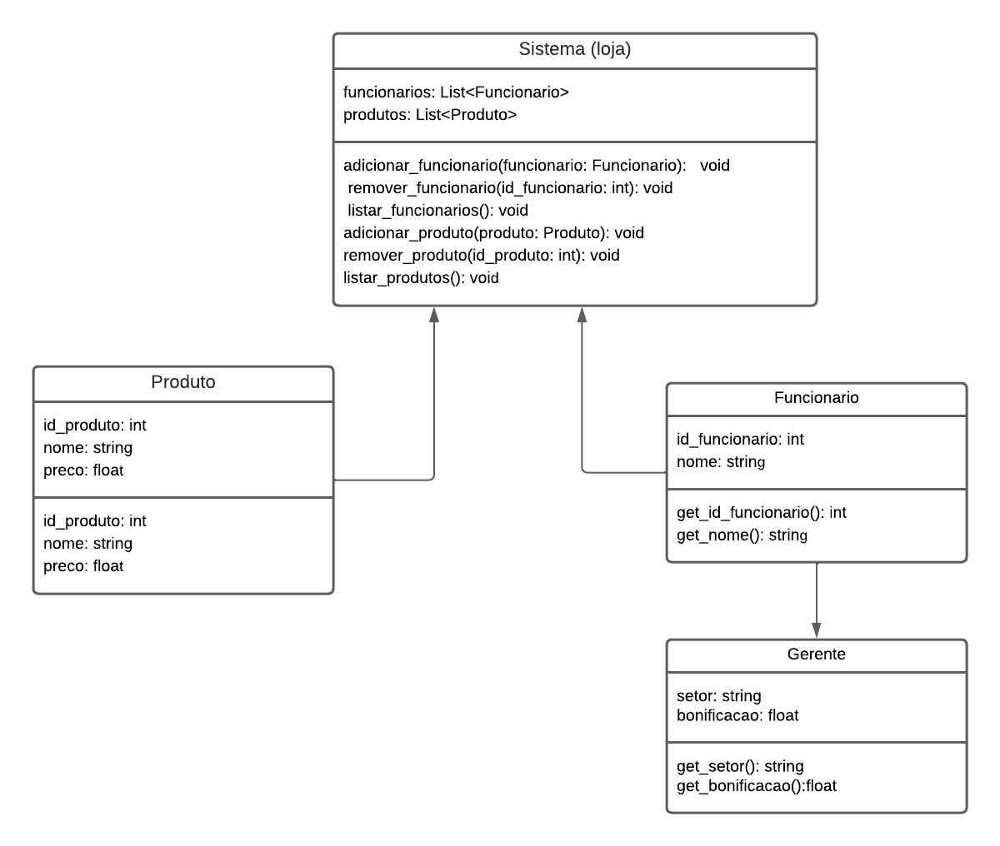

# Atividade 4

Nesta atividade, desenvolvemos um sistema simples representando os conceitos de Encapsulamento e Herança.

## Descrição do Sistema

O sistema contém as seguintes classes:

- `CarrinhoDeCompra`: Classe que representa uma coleção de produtos.
- `Cliente`: classe que representa um comprador em potencial
- `Pedido`: classe que representa a solicitação de um item
- `Produto`: classe que representa um produto 

## Diagrama de classe UML

